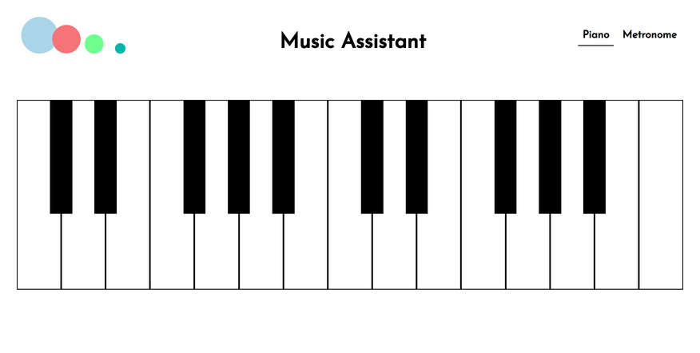
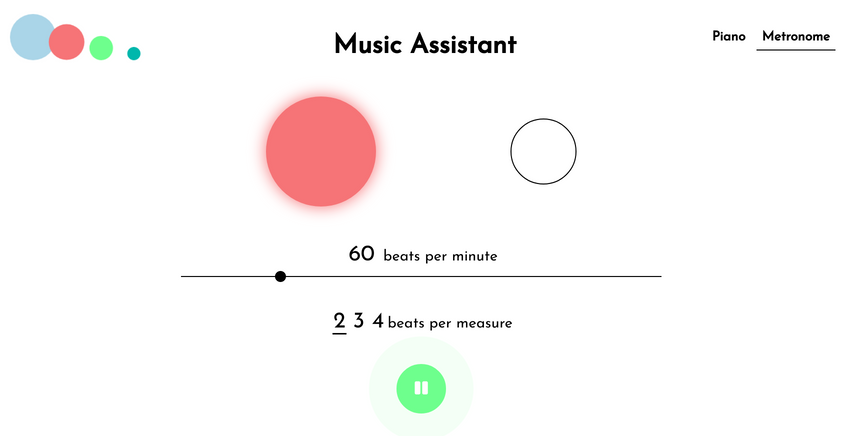

# music-assistant

Music Assistant - fully responsive web application built with React including piano and metronome.

Web app dedicated to professional and amateur musicians offering functionalities such as a piano and a metronome, essential while reading musical scores.

### Used technologies
- React
- React Router
- CSS

This project was bootstrapped with [Create React App](https://github.com/facebook/create-react-app).
